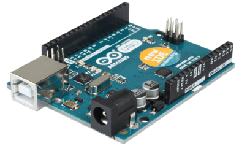
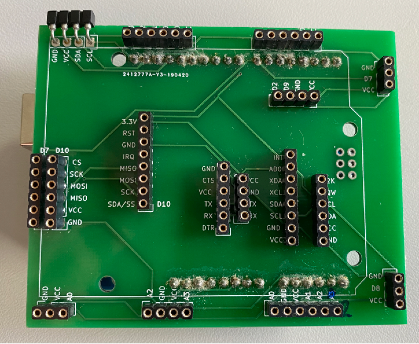
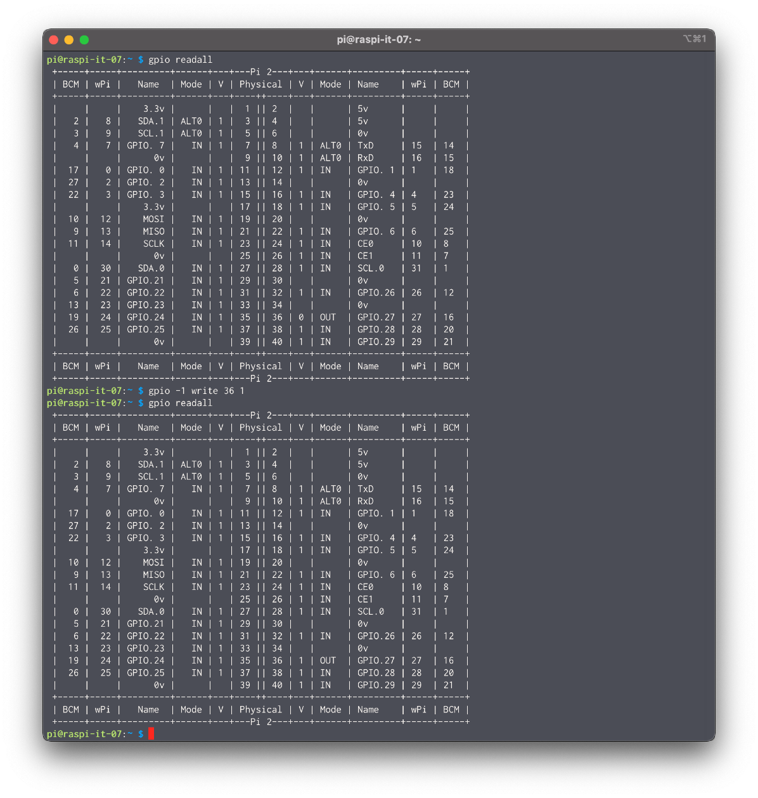

# Allgemeines

## Arduino

* Wir in der Schule verwenden folgenden Arduino: Arduino Uno
* Hauptkomponente ist der Mikrocontroller von AMTEL,der ATmega 328P
* 14 digitale I/O Pins (davon sechs Pulsweitenmodulation Pins, welche zum Beispiel das Dimmen von LEDs ermöglicht)
* 6 analoge Input Pins
* Zum Datenaustausch und zur Programmierung wird die USB Schnittstelle zwischen Arduino und Computer verwendet. Da der Mikrocontroller nicht direkt mit USB kommuniziert, befindet sich ein zweiter Mikrocontroller (ATmega8U2) am Board, der die Übersetzung übernimmt.
* Das Board beherrscht die Kommunikation per UART (Universal Asynchronous Receiver Transmitter), SPI (Serial Peripheral Interface) und I2C (TWI).
* Kein Betriebssystem sowie Prozesse oder Threads
* 8 Bit CPU

### Breakout Platine

| Pin           | Verwendung                                                          | Einschränkung                                                                  |
|---------------|---------------------------------------------------------------------|--------------------------------------------------------------------------------|
| SCL/A5        | I²C Clock                                                           | Analog einlesen auf SCL/A5                                                     |
| SDA/A4        | I²C Data                                                            | Analog einlesen auf SDA/A4                                                     |
| D0/RX         | Bluetooth und USB-Adapter                                           | Upload (jedenfalls)                                                            |
| D1/TX         | Bluetooth und USB-Adapter                                           | Upload (eventuell)                                                             |
| D7            | Mikro-SD-Slave Select, Bewegungsmelder/Entfernungsmesser ‚D7‘       | Bewegungsmelder/Entfernungsmesser ‚D7‘ XOR Mikro-SDLesegerät                   |
| D8            | RFID-Lesegerät-Reset, Bewegungsmelder/Entfernungsmesser ‚D8‘        | Bewegungsmelder/Entfernungs messer‚ D8‘ XORRFIDLesegerät                       |
| D10/SPI-SS    | Motoren D10/…, RFID-Lesegerät- Slave Select                         | Motor D10/… XOR SPI (Ausnahme: D7 als Slave Select)                            |
| D11/SPI-MOSI  | Motoren D10/…, MOSI für SPI- Anschlüsse (MicroSD-/RFID- Lesegeräte) | Motor D10/… XOR SPI                                                            |
| D12/SPI-MISO  | Motoren D10/…, MISO für SPI- Anschlüsse (MicroSD-/RFID- Lesegeräte) | Motor D10/… XOR SPI                                                            |
| D13/SPI-SCK   | Motoren D10/…, SCK für SPIAnschlüsse (Micro-SD-/RFIDLesegeräte)     | Motor D10/… XOR SPI                                                            |
| A0, A2 und A3 | Analoger Eingang                                                    | Bei Verbindung eines analogen Pins mit mehreren Sensorenresultieren Messfehler |

## Raspberry Pi

Der Raspberry Pi ist ein Einplatinencomputer, der von der britischen Raspberry Pi Foundation entwickelt wurde. Der Rechner enthält ein Ein-Chip-System von Broadcom mit einer Arm-CPU. Die Platine hat das Format einer Kreditkarte.

### GPIO

* Die Abkürzung GPIO steht für "General Purpose Input/Output”.
* Diese 40 Pins bilden eine Schnittstelle, um Mikrocontroller mit anderen elektronischen Geräten zu verbinden und ermöglichen die Kommunikation mit externen Geräten oder auch die Realisierung diverser Schaltungen.
* Davon sind allerdings nur 26 belegt, manche der Pins erfüllen aber mehrere Zwecke und müssen entsprechend über eine passende Programmierung definiert werden.
* So können Sensoren und Aktoren über GPIO verbunden werden.
* Welche Aufgabe die Pins übernehmen sollen, lässt sich über eine softwareseitige Programmierung mittels C oder Python realisieren.

#### Eingang

Ist ein GPIO als Eingang definiert, dann nimmt er Schaltzustände externer Schaltungsteile an. Das kann im einfachsten Fall ein Taster oder Schalter sein. In jedem Fall muss ein Potential/Pegel (Spannung) anliegen, damit der Eingang den anliegenden Zustand (1 – HIGH / 0 LOW) auswerten kann. Damit drückt man die anliegende Spannung aus, die +3,3 V oder 0 V betragen muss. Dabei dürfen am Eingang nicht mehr als +3,3 V anliegen, sonst könnte es den Eingang zerstören. Die Spannungswerte unterliegen einer Toleranz, so können Spannungen unter 0,8 V als LOW und Spannungen über 1,3 V als HIGH erkannt werden. Wenn keine definierte Spannung anliegt (unbeschalteter Eingang), dann neigen die Eingänge in irgendeine Richtung zu schwingen. Das heißt, sie nehmen wechselweise den Zustand HIGH oder LOW an, was man vermeiden sollte. Über Pullup- / PulldownWiderstände kann man Einfluss darauf nehmen, welchen Grundzustand ein GPIO-Eingang haben soll.4 

#### Ausgang

Ist ein GPIO als Ausgang definiert, dann kann man Schaltzustände an externe Schaltungsteile weitergeben. Hält man sich nicht an die Grenzwerte, dann kann der Raspberry Pi teilweise zerstört werden:

* Die GPIO-Anschlüsse haben eine maximale Steuerspannung von +3,3 Volt
* Der entnehmbare Strom aus einem GPIO liegt bei maximal 16 mA
* Die Empfehlung pro GPIO liegt bei 2 oder 3 mA
* Aus allen GPIOs zusammen darf maximal ein Strom von 51 mA entnommen werden
* An einem GPIO kann man nicht jede Art von Last betreiben

#### GPIO auf der Linux Konsole

* `gpio readall`
* `gpio -1 write <physical pin id> <0/1>`

