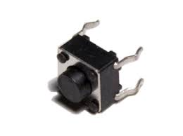
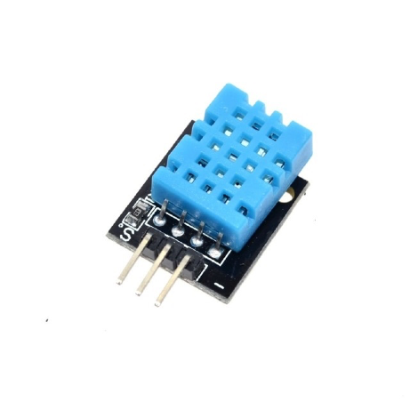
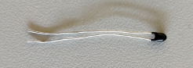
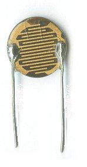
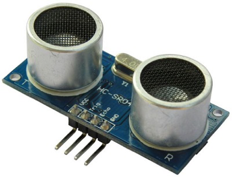
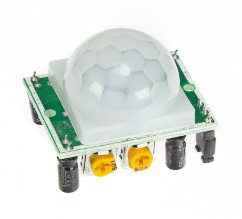

# Sensoren

## Taster

Der digitale Taster ist über eine Platine mit Breakout Platine verbunden.

| Sensor | Aufbau |
|--------|--------|
|  | !()[./assets/taster_aufbau.png] |

## Temperatur- & Feuchtigkeitssensor (DHT11)

Zur Ansteuerung des Sensors nehmen wir die DHT11-Libs von Adafruit. Diese entschlüsselt uns die gesendeten Bitmusterketten und wir können einfach über eine Funktion auf die ergebenen Zahlen zugreifen.

Der Baustein besteht aus einem Feuchtigkeitsssensor, einem NTC-Temperatursensor (oder Thermistor) und einem Chip auf der Rückseite des Sensors.

Zur Messung der Feuchte existieren im Feuchtigkeitssensor zwei Elektroden mit eine, feuchtigkeitshaltendem Substrat zwischen beiden. Wenn sich also die Luftfeuchtigkeit ändert, ändert sich die Leitfähigkeit des Substrats oder der Widerstand zwischen diesen Elektroden. Diese Widerstandsänderung wird vom Chip gemessen und verarbeitet, so dass sie von einem Mikrocontroller gelesen werden kann. Zum anderen verwenden diese Sensoren zur Temperaturmessung einen NTC-Temperaturfühler oder Thermistor.

Ein Thermistor ist eigentlich ein veränderlicher Widerstand, der seinen Widerstand bei Änderung der Temperatur ändert. Diese Sensoren werden durch Sintern von Halbleitermaterialien wie Keramik oder Polymeren hergestellt, um größere Widerstandsänderungen bei geringen Temperaturänderungen zu erreichen. Der Begriff “NTC” bedeutet “Negativer Temperaturkoeffizient”, was bedeutet, dass der Widerstand mit zunehmender Temperatur abnimmt.

| Sensor | Aufbau |
|--------|--------|
|  | !()[./assets/dht11_aufbau.png] |

## Temperaturempfindlicher Widerstand (NTC)

Ein NTC-Widerstand (Negative Temperature Coefficient Thermistor) ist ein temperaturabhängiger Widerstand, welcher zu der Gruppe der Thermistoren zählt. Er weist als wesentliche Eigenschaft einen negativen Temperaturkoeffizienten auf und leitet bei hohen Temperaturen den elektrischen Strom besser als bei tiefen Temperaturen.

NTCs dienen als Temperatursensor oder als Einschaltstrombegrenzer. Um die typisch perlenförmigen Temperatursensor-NTCs zu kontaktieren, kommen Drähte aus einer Platinlegierung oder aus Nickel/Eisen zum Einsatz.[2] Sie verbinden sich beim Sintern der Perle mit dem NTC-Material. Andere Bauformen sind Scheiben, SMD-Chips oder zylindrische Formen sie werden mittels metallisierter Oberflächen kontaktiert.

| Sensor | Aufbau |
|--------|--------|
|  | !()[./assets/ntc_aufbau.png] |

## Fotowiderstand (LDR)

Folgenden Fotowiderstand verwendeten wir: GL5528

Ein Fotowiderstand, auch Photowiderstand oder englisch Light Dependent Resistor, ist ein lichtempfindliches elektrisches Bauelement.

Je mehr Licht auf den Fotowiderstand fällt, desto kleiner wird sein elektrischer Widerstand. Die Ursache für diese Funktion ist der innere fotoelektrische Effekt in einer Schicht, die aus einem amorphen Halbleiter besteht. Im Vergleich zu anderen Lichtsensoren reagieren Fotowiderstände sehr langsam.

Fotowiderstände werden beispielsweise in Belichtungsmessern und in Dämmerungsschaltern eingesetzt, um mit geringem technischem Aufwand auch geringe Beleuchtungsstärken messen zu können – die spektrale Empfindlichkeit stimmt gut mit der Hellempfindlichkeitskurve des Auges überein. Die Verwendung bietet sich an, wenn keine schnellen Reaktionszeiten gefordert sind.

| Sensor | Aufbau |
|--------|--------|
|  | !()[./assets/ldr_aufbau.png] |

## Entfernungssensor

Wir folgenden Entfernungssensor: HC-SRO4

Zusätzlich verwenden wir eine weitere Steckplatine, um das Trigger und das Echo Signal auf einen Pin zu legen. Weiters verwenden wir die „NewPing“-Library, damit diese Pinzusammenlegung funktioniert.

Der Ultraschallsensor HC-SR04 benötigt zunächst eine Versorgungsspannung von 5V, dafür stehen die Anschlüsse +5V (Pin 1) und GND (Pin 4) bereit. Die eigentliche Messung wird über den Anschluss Trigger (Pin 2) gestartet. Der Messvorgang wird durch eine fallende Flanke am TriggerEingang ausgelöst.

Auch ein für den Mensch nicht hörbarer Ultraschallton ist ein akustischer Schall. Er verhält sich demnach entsprechend den physikalischen Gesetzen. Der Schall hat eine bestimmte Geschwindigkeit, er legt in der Sekunde 330 Meter zurück. Wenn man also weiß wie lange es dauert bis der Ultraschallsensor sein eigenes Echo empfängt, dann kann man leicht ausrechnen wieviel Meter bzw. auch Zentimeter der Schall zurückgelegt hat. Diese errechnete Entfernung muss man dann allerdings noch durch 2 teilen, denn wir wollen ja nur die einmalige Wegstrecke berechnen und nicht den gesamten Hin- und Rückweg.

| Sensor | Aufbau |
|--------|--------|
|  | !()[./assets/hcsro4_aufbau.png] |

## Bewegungssensor

Wir verwenden folgenden Bewegungssensor: HC-SR501

Der Bewegungsmelder laufen unter der Bezeichnung "PIR-Sensor", wobei "PIR" für "Passive Infra Red" (passiver Infrarot-Sensor) steht. 

Solche Infarot-Bewegungsmelder (meist nur "Bewegungsmelder" genannt) dienen oft zum automatischen Einschalten von Beleuchtung etc. Sie erkennen eine bestimmte Menge an Infarotstrahlen/Wärme) und werten diese Information aus. Schlicht gesagt, reagieren Sie auf die Wärme des menschlichen Körpers (oder auch von Hund, Katze usw.).

Damit aber nicht statische Wärmequellen (besonntes Fenster, Heizkörper etc.) den Senso triggern, regieren solche Sensoren auf bewegliche Wärmequellen. Damit das funktioniert, ist eine FesnelLinse vor dem Sensor augeordnet. Das folgende Bild zeigt den PIR-Sensor auf der Platine und daneben die abgenommene Fresnel-Linse.

| Sensor | Aufbau |
|--------|--------|
|  | !()[./assets/hcsr501_aufbau.png] |