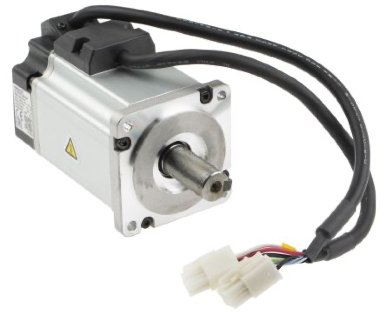
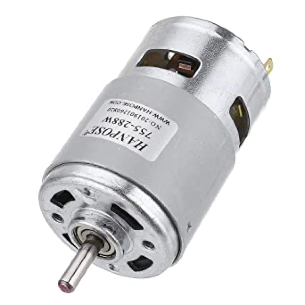
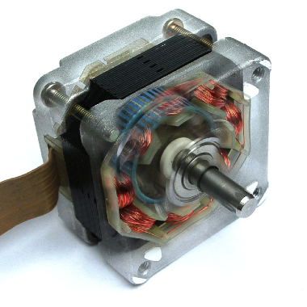

# Aktoren

- [Servomotor](#servomotor)
- [DC-Motor](#dc-motor)
- [Schrittmotor](#schrittmotor)

## Servomotor

Als Servomotor werden spezielle Elektromotoren bezeichnet, die die Kontrolle der Winkelposition ihrer Motorwelle sowie der Drehgeschwindigkeit und Beschleunigung erlauben. Sie bestehen aus einem Elektromotor, der zusätzlich mit einem Sensor zur Positionsbestimmung ausgestattet ist.

* Servomotor (Antriebstechnik): servo motor, servomotor. Ist ein beliebiges Antriebssystem mit guter Regelbarkeit.
* Ein Servomotor ist ein elektrischer Motor, der strom-, drehzahl- und/oder positionsgeregelt ist. Er ermöglicht die Einstellung vorgegebener Ströme, Drehzahlen und/oder Drehwinkel.
* Als Servomotor werden spezielle Elektromotoren bezeichnet, die die Kontrolle der Winkelposition ihrer Motorwelle sowie der Drehgeschwindigkeit und Beschleunigung erlauben. Sie bestehen aus einem Elektromotor, der zusätzlich mit einem Sensor zur Positions-bestimmung ausgestattet ist. 



```c
#include <Servo.h>

Servo servo1;

void setup() {
	servo1.attach(9);
}

void loop() {
	servo1.write(70);
	delay(1000);

	servo1.write(140);
	delay(1000);
}
```

Beispiele:
- [Arduino: Servomotor Steuerung über Slider](https://github.com/htlw-5ahit/matura-syt/tree/main/thema01-03/code/servomotor_steuerung)
- [Arduino: Servomotor Steuerung mit Temperatursensor](https://github.com/htlw-5ahit/matura-syt/tree/main/thema01-03/code/servomotor_dht11)

## DC-Motor

Ein Gleichstrommotor dient der Umwandlung von elektrischer Energie in mechanische Energie, mit der mechanische Arbeit verrichtet wird. Dabei wird eine Drehbewegung erzeugt, die man zum Antrieb von Geräten und Anlagen verwendet. Genutzt wird das Prinzip, dass auf einen stromdurchflossenen Leiter im Magnetfeld eine Kraft wirkt. Die wesentlichen Bauteile eines Gleichstrommotors sind der Feldmagnet (Stator), der drehbar gelagerte Anker (Rotor), der Kollektor und die Kohlebürsten.

Durch den Feldmagneten (Dauer- oder Elektromagnet) wird ein magnetisches Feld aufgebaut. In diesem Feld ist ein Elektromagnet drehbar gelagert - der Anker. Über Kohlebürsten als Schleifkontakte wird der Anker an eine Stromquelle angeschlossen. Durch den Stromfluss im Anker wird dieser magnetisch, wodurch Kräfte zwischen Feldmagneten und Anker auftreten. Gleiche Magnetpole stoßen sich ab, ungleiche Magnetpole ziehen sich an. Diese abstoßenden und anziehenden Kräfte zwischen den Magnetpolen führen zu einer Drehbewegung des Ankers.



```c
#define SLIDER A0
#define BUTTON 2
#define MOTOR_FORWARD 06
#define MOTOR_BACKWARD 04
#define MOTOR_PWM 03

float sliderValue = 0;
boolean directionForward = true;

void setup() {
  pinMode(SLIDER, INPUT);
  pinMode(BUTTON, INPUT);

  pinMode(MOTOR_FORWARD, OUTPUT);
  pinMode(MOTOR_BACKWARD, OUTPUT);
  
  pinMode(MOTOR_PWM, OUTPUT);
}

void loop() {
  sliderValue = analogRead(SLIDER);

  // forwaerts / rueckwaerts schalten des motors via button
  if (digitalRead(BUTTON) == HIGH) {
    directionForward = !directionForward;
    delay(100);
  }

  analogWrite(MOTOR_PWM, sliderValue / 4);
  
  digitalWrite(MOTOR_FORWARD, directionForward);
  digitalWrite(MOTOR_BACKWARD, !directionForward);
}
```

Beispiele:
- [Arduino: Geschwindigkeit- und Richtungssteuerung](https://github.com/htlw-5ahit/matura-syt/tree/main/thema01-03/code/dcmotor_steuerung)
- [Arduino: Richtungssteuerung nur durch Slider](https://github.com/htlw-5ahit/matura-syt/tree/main/thema01-03/code/dcmotor_slider)

## Schrittmotor

Ein Schrittmotor ist ein Synchronmotor, bei dem der Rotor (ein drehbares Motorteil mit Welle) durch ein gesteuertes, schrittweise rotierendes, elektromagnetisches Feld der Statorspulen (Stator ist ein nicht drehbarer Motorteil) um einen kleinen Winkel (Schritt) oder sein Vielfaches gedreht werden kann. Schrittmotoren gibt es auch als Linearmotoren.



```c
int count;

#include <Stepper.h>

const int stepsPerRevolution = 20; // change this to fit the number of steps per revolution
// for your motor

// initialize the stepper library on pins 8 through 11:
Stepper myStepper1(stepsPerRevolution, 3, 6, 5, 4); //P1, P2, P3, P4

void setup() {
	count=0;
	myStepper1.setSpeed(5.0);
}

void loop() {
	count=count+1;
	myStepper1.step(stepsPerRevolution);
	delay(100);
	myStepper1.step(-stepsPerRevolution);
}
```

Beispiele:
- [Arduino: 4-poliger Schrittmotor](https://github.com/htlw-5ahit/matura-syt/tree/main/thema01-03/code/schrittmotor)
- [Arduino: Schrittmotor mit Drehgeber](https://github.com/htlw-5ahit/matura-syt/tree/main/thema01-03/code/schrittmotor_drehgeber)
- [Arduino: Schrittmotor asynchron verwenden](https://github.com/htlw-5ahit/matura-syt/tree/main/thema01-03/code/schrittmotor_asynchron)