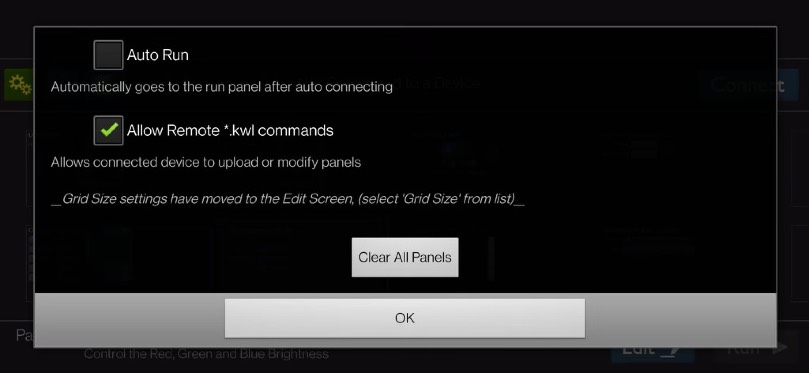
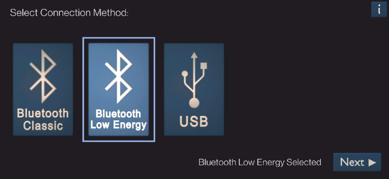
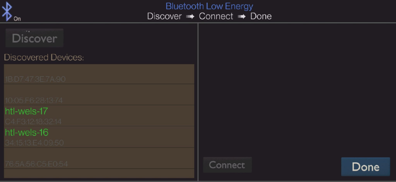
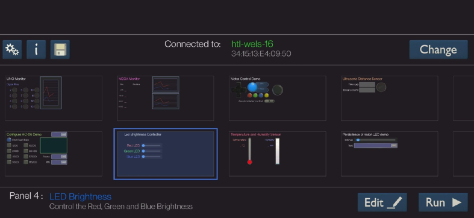

# Bluetooth mit Arduino

* [Bluetooth Electronics App](https://play.google.com/store/apps/details?id=com.keuwl.arduinobluetooth)
* Mit dieser App kann man eine GUI auf dem Handy mittels Steuerelementen zusammenbauen. Anschließend kann ein Arduino Code exportiert werden. Diesen kopiert man sich in die Arduino Entwicklungsumgebung und wird dann angepasst.

## App konfigurieren

Beim ersten Mal starten der Konfiguration, haben wir „Allow Remote .*kwl commands“ aktiviert. Dies ist unter den Einstellungen durchzuführen.

## Verbindung via Bluetooth

Unter Bluetooth gibt es zwei verschiedene Versionen. „Bluetooth Classic“ ist ein alter Standard. Wir jedoch verwenden „Bluetooth Low Energy“, um uns mit dem Bluetooth-Modul am Arduino zu verbinden.

In der nächsten Ansicht, sieht man alle Bluetoothgeräte in der Nähe. Dort muss sich das richtige Geräte auswählen und auf „Connect“ und anschließend „Done“ klicken.

Anschließend ist man im Dashboard der Applikation, wo man alle erstellte Panel sieht.

## Beispiele

- [Bluetooth Beispiele](https://github.com/htlw-5ahit/matura-syt/tree/main/thema01-03/code/bluetooth/)