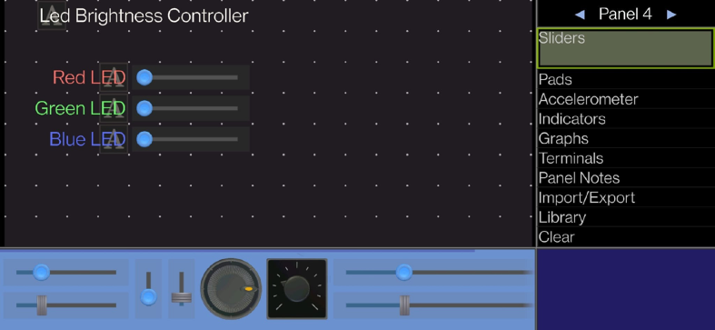
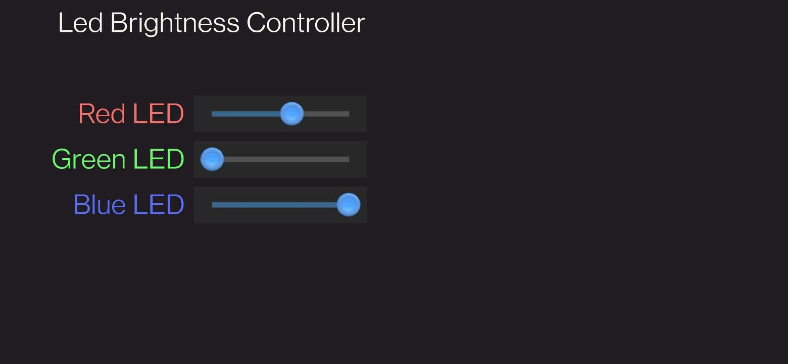
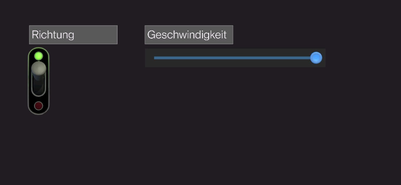
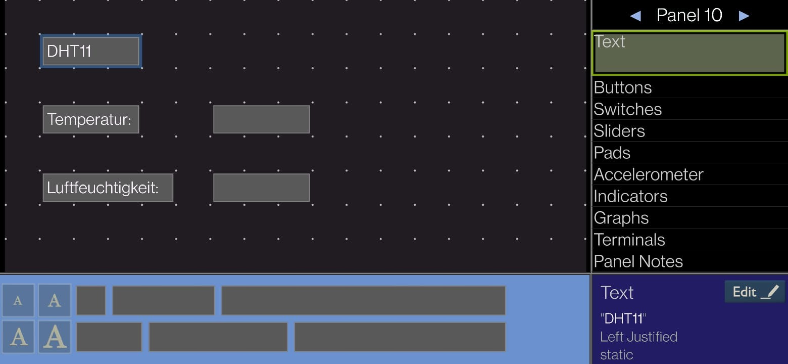

# Bluetooth am Arduino

Als erstes haben wir eine Vorlage vom Entwickler übernommen und adaptiert. Beim automatisch genierten Code haben wir eine kleine Änderung bei der Ausgabe der GUI durchgeführt. Um die Strings in der „setup()“-Funktion, muss F(„<string>“) geschrieben werden. Dadurch wird der String im Flash-Speicher abgelegt und nicht im RAM-Speicher.

## LED Brightness Controller

## DC Motor Controller

## Anzeige eines DHT11

## Steuerung eines Bewegungssensors mit LED

