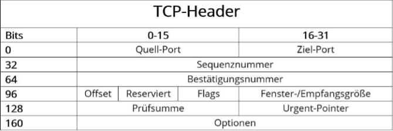

# TCP/UDP

## Referenzmodell

* Als Ausgangsmodell gab bzw. gibt es das OSI/ISO Modell sowie für Netzwerkprotokolle und Ausgangsmodell für die allgemeinen Schichtenarchitektur.
* Ermöglichung einer einheitlichen und effektive Kommunikation unabhängig des technischen Systems

## OSI-Layer

Das Schichtenmodell, das OSI/ISO Modell, besteht aus sieben Schichten. Diese lassen sich in viele verschiedene Kategorien einteilen.

Quelle: [https://de.wikipedia.org/wiki/OSI-Modell](https://de.wikipedia.org/wiki/OSI-Modell)

## Protokollstack

* Ein Protokollstapel ist in der Datenübertragung eine konzeptuelle Architektur von Kommunikationsprotokollen.
* Jede Schicht benutzt dabei zur Erfüllung ihrer speziellen Aufgabe die jeweils tiefere Schicht im Protokollstapel.
* Daten, die über ein Netz übertragen werden, werden von einem Netzwerkprotokoll des Stapels nach dem anderen verarbeitet. 
* Beim Senden fügt jedes Protokoll den Daten bestimmte Steuerinformationen hinzu, bevor sie dem nächsttieferen Netzwerkprotokoll übergeben werden.
* Beispiel:
    * Eine HTTP-Nachricht, die via Ethernet versandt wird, lässt sich wie folgt veranschaulichen
    

Quelle: [https://de.wikipedia.org/wiki/Protokollstapel](https://de.wikipedia.org/wiki/Protokollstapel)

## Schichtenmodell: Wofür ist jede Schicht zuständig?

1. Bitübertragungsschicht (Physical Layer)
    * Umwandlung der Bits in ein zum Medium passendes Signal und physikalische Übertragung
    * Signale, Laser, Lichtleiter, WLAN, ...
    * Geräte: Antenne, Verstärker, Stecker, Buchse, Netzwerkkabel, Repeater, Hub

2. Sicherungsschicht (Data Link Layer)
    * Regelt Zugriff auf das Übertragungsmedium
    * Gesamter Datenstrom wird in Bitblöcke (Frames) aufgeteilt und Prüfsumme hinzugefügt
    * Geräte: Bridge, Switch
    * Protokolle: ARP, RARP, STP, HDLC, SDLC

3. Vermittlungsschicht (Network Layer)
    * Routing der Datenpakete zum nächsten Knoten
    * Bereitstellen der netzwerkübergreifenden Adressen
    * Auf- und  Abbau der Verbindung
    * Fragmentierung der Datenpakete
    * Geräte: Router, Layer3-Switch
    * Protokolle: IP, IPx, ICMP

4. Transportschicht (Transport Layer)
    * Segmentierung des Datenstroms
    * Sicherstellung der fehlerfreien Übertragung
    * Zuordnung der Datenpakete zu einer Anwendung
    * Protokolle: TCP, UDP, SCTP, DCCP

5. Sitzungsschicht (Session Layer)
    * Steuerung der Verbindungen und des Datenaustauschs.
    * Organisiert Kommunikation zwischen 2 Systemen

6. Darstellungsschicht (Presentation Layer)
    * Umwandlung der systemabhängigen Daten in ein unabhängiges Format
    * Datenkompression und Verschlüsselung wird hier durchgeführt

7. Anwendungsschicht (Application Layer)
    * Dienste, Anwendungen und Netzmanagement
    * Funktionen für Anwendungen sowie die Dateneingabe und -ausgabe

## Verbindungsauf/-abbau (Was passiert auf der Leitung – SYN SYN/ACK)

#### Aufbau

* Der Verbindungsaufbau läuft nach dem Three-Way-Handshake ab.
* Zuerst schickt der Client an den Server einen Verbindungswunsch (SYN).
* Der Server bestätigt den Erhalt der Nachricht (ACK) und äußert ebenfalls seinen Verbindungswunsch (SYN).
* Der Client bestätigt den Erhalt der Nachricht (ACK).
* Danach erfolgt der Datenaustausch zwischen Client und Server.

#### Kommunikation

* Der Sender beginnt mit dem Senden des ersten Datenpakets (Send Paket 1).
* Der Empfänger nimmt das Paket entgegen (Receive Paket 1) und bestätigt den Empfang (Send ACK Paket 1).
* Der Sender nimmt die Bestätigung entgegen (Receive ACK Paket 1) und sendet das zweite Datenpaket (Send Paket 2).
* Der Empfänger nimmt das zweite Paket entgegen (Receive Paket 2) und bestätigt den Empfang (Send ACK Paket 2).
* Der Sender nimmt die zweite Bestätigung entgegen (Receive ACK Paket 2).
* Und so läuft der Datenaustausch weiter, bis alle Pakete übertragen wurden.

#### Verbindungsabbau

* Der Verbindungsabbau kann sowohl vom Client als auch vom Server vorgenommen werden.
* Zuerst schickt einer der beiden der Gegenstelle einen Verbindungsabbauwunsch (FIN).
* Die Gegenstelle bestätigt den Erhalt der Nachricht (ACK) und schickt gleich darauf ebenfalls einen Verbindungsabbauwunsch (FIN).
* Danach bekommt die Gegenstelle noch mitgeteilt, dass die Verbindung abgebaut ist (ACK).

## Aufbau TCP-Header (wichtigste Felder, Control Flags, Aufbau)

* Quell-Port (16 Bit): Gibt die Portnummer des Senders an.
* Ziel-Port (16 Bit): Gibt die Portnummer des Empfängers an.
* Sequenznummer (32 Bit): Die Sequenznummer gibt das erste Byte der angehängten Nutzdaten an und dient der Validierung und Sortierung (im Anschluss an die Übertragung) der Segmente.
* Bestätigungsnummer (32 Bit): Bestätigungsnummer, die der Absender als nächstes erwartet. 
* Offset (4 Bit): Das Feld „Offset“ weist die Länge des TCP-Headers in 32-Bit-Blöcken aus, um den * Startpunkt der Nutzdaten hervorzuheben. 
* Reserviert (6 Bit): RFC 793 entsprechend für künftige Nutzung reserviert, bis dato nicht verwendet. Dieses Feld muss immer den Wert „0“ haben.
* Flags (6 Bit): Über die sechs möglichen Einzel-Bits im Flags-Feld lassen sich verschiedene TCP-Aktionen aktivieren, um die Kommunikation und Datenverarbeitung zu organisieren.
    * URG - "Urgent" - "dringend"
    * ACK - "Acknowledgement" - Empfang quittieren
    * PSH - "Push"
    * RST - "Reset" - Fehler während der Übertragung
    * SYN - Erster Schritt bei 3-Way-Handshake
    * FIN - "Finish" - Signalisierung zur Beendigung einer Übertragung
* Fenstergröße (16 Bit): In diesem Feld wird dem Kommunikationspartner die Anzahl an Bytes übermittelt, die der Sender bereit ist zu empfangen.
* Prüfsumme (16 Bit): Das Transmission Control Protocol kann Übertragungsfehler zuverlässig erkennen. Hierfür wird die Prüfsumme herangezogen, die aus dem Header, den Nutzdaten und dem sogenannten Pseudo-Header berechnet wird.
* Urgent-Pointer (16 Bit): Der Urgent-Pointer („Dringend“-Anzeiger) gibt die Position des ersten Bytes nach den dringlich zu behandelnden Nutzdaten an. Folglich ist dieses Feld nur gültig und relevant, wenn das URG-Flag gesetzt ist.
* Optionen (0–320 Bit): Sollen TCP-Funktionen bereitgestellt werden, die nicht in den generellen Header gehören, geschieht dies über das Optionsfeld – ein mögliches Beispiel ist die Definition der maximalen Segmentgröße. Die Optionen müssen immer eine Länge des Vielfachen von 32 Bit haben, andernfalls ist die Auffüllung mit Null-Bits (Padding) erforderlich.

## Timeout/Prüfsumme, ARP-Protokoll

## Was genau versteht man unter Routing und warum ist dies so praktisch?

Network Address Translation (NAT) ermöglicht es, die Ziel- oder Quell-IP-Adressen eines Datenpakets durch eine andere Adresse zu ersetzen. NAT wird häufig verwendet, um aufgrund der Knappheit öffentlicher IP-Adressen mit privaten IP-Adressen im Internet zu kommunizieren. Diese Maskierung mehrerer privater IP-Adressen hinter einer öffentlichen IP-Adresse hat auch sicherheitstechnische Vorteile.

## Wofür braucht man NAT (könnte man darauf auch verzichten?)

Auf NAT kann man in nicht mehr verzichten, da nicht genügend IPv4-Adressen vorhanden sind.

## Unterschied TCP/UDP

## Aufteilung des Streams auf Packages?

## Wie werden Packages über das Netz versendet?

## Wie kann der Stream am Endpoint wieder zusammengebaut werden?

## Wie garantiert TCP, dass das Package tatsächlich ankommt (welche zusätzliche Kommunikation ist da notwendig?)

## Wie groß kann ein TCP-Package werden – wovon hängt dies noch ab?

## Chiffrieren von Daten - wo geschieht diese im TCP-Stack?