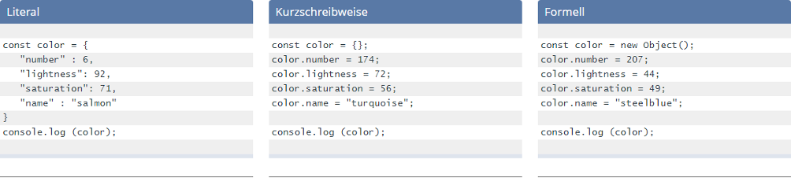
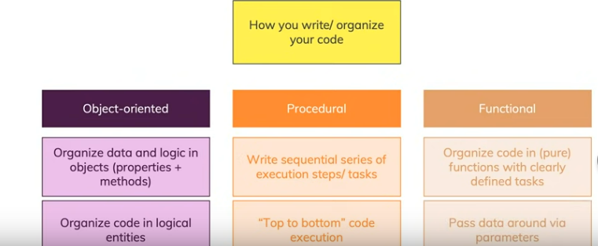

# JavaScript/ECMA-Script

## Grundlegendes

* Hinzufügen von Interaktionen zu HTML-Seiten
* Beispiel: Knopfdruck, Formularkontrolle, Bildergallerie, Animationen, ...

## Historie

* 1955 von Netscape eingeführt und lizenziert
* Versuch eines Standards zu verliehen durch die Organisation ECMA (European Computer Manufacturers Assiciation)
* ECMA-Skript wurde die Grundlage von JavaScript als Industriestandard

## Elemenare Konstrukte / Syntax

* schwach typisierte oder dynamische Programmiersprache
* Primitive Datentypen
    * Boolean
    * Null
    * Undefined
    * Number
    * String
    * Symbol
* Nicht-primitiver Datentyp:
    * Object

## Keine Datentypen - Auswirkung auf die Programmierung?

* Zwei Typen von Variablen
    * `let` ... Verfügbarkeit nur in der Funktion
    * `var` ... Verfügbarkeit in der ganzen JavaScript-Datei
* Lose Typisierung
    * Es werden keine Typen zu den Variablen geschrieben.
    * Der Typ ist automatisch abhängig von zugewiesenen Wert
    * Eine Variable im Laufe ihres Lebens Typen haben
    * Kein Casting
    * `typeof` gibt den Typ als Rückgabewert zurück

## Funktionen

* Funktionsdeklaration

```js
function foo ([parameter1[, parameter2[, …]]]) { 
    /* tue etwas, optional Rückgabe mit return */ 
}
```

* Funktionsausdruck, der einer Variablen zugewiesen wird

```js
var func = function ([parameter1[, parameter2[, …]]]) { 
    /* tue etwas, optional Rückgabe mit return */ 
};
```

* Statement vs Funktionsausdruck

```js
tuwas(3);       // Funktioniert
machwas(5);     // Error: machwas ist keine Funktion

function tuwas(q) {
   return q*3;
}

var machwas = function(q) {
   return q*5;
}

machwas(17);    // Hier funktioniert es.
```

* variadische Funktion

```js
function baueNachricht(info, ...teile) {
   return info + ": " + teile.join(', ');
}

alert(baueNachricht("Finde die Lösung in", "SelfHTML", "MDN", "Wikipedia"));
// Ergibt: Finde die Lösung in: SelfHTML, MDN, Wikipedia
```

## Objekte

* Sammlung von logisch zusammengehörenden Variablen



## Vererbung

* Überschreibung von Funktionen möglich
* Keine Polymorphie, da es keine Typen gibt

## `this`-Parameter

* Verweis auf das eigene `window`-Objekt, das die aktuelle JS-Funktion aufgerufen hat
* Können durch Verwendung von Closures vermieden werden

## Google-V8-Engine

* Freie Implementierung von JavaScript nach dem Standard ECMA-262
* Veröffentlicht von Google Inc. unter BSD-Lizenz
* Teil des Google Chrome Browsers
* Beschleunigte Ausführung von JS-Code
* Auch zu finden in Node.js un MongoDB

## Interpreter / Compiler

* JavaScript ist eine interpretierte Sprache
* Interpreter im Browser interpretiert jede Zeile und führt diese aus
* Bei modernen Browsern erfolgt jedoch eine Just-In-Time-Kompilierung unmittelbar vor dem Ausführen in ausführbarem Bytecode

[https://web.stanford.edu/class/cs98si/slides/overview.html](https://web.stanford.edu/class/cs98si/slides/overview.html)

## Fehlerbehandlung

* Registrierung einer Fehlerbehandung mit dem `error`-Event

```js
//  Registriere eine Fehlerbehandlung
window.addEventListener("error", fehlerbehandlung);

function fehlerbehandlung (errorEvent) {
    var fehler = "Fehlermeldung:\n" + errorEvent.message + "\n" + errorEvent.filename + "\n" + errorEvent.lineno;
    zeigeFehler(fehler);
    errorEvent.preventDefault();
}

function zeigeFehler(meldung) {
    alert(meldung);
}

//  Löse einen Laufzeitfehler aus, in dem eine undefinierte Funktion aufgerufen wird:
nichtDa();
```

* Registrieren einer Fehlerbehandlung mit der onerror-Eigenschaft

```js
window.onerror = fehlerbehandlung;

function fehlerbehandlung (nachricht, datei, zeile) {
    var fehler = "Fehlermeldung:\n" + nachricht + "\n" + datei + "\n" + zeile;
    zeigeFehler(fehler);
    return true;
}

function zeigeFehler (meldung) {
    alert(meldung);
}
```

* Fehlerbehandlung mit try..catch

```js
function zeigeErgebnis (zaehler, ergebnis) {
    alert("Nach " + (Zaehler) + " Durchläufen existierte x.\nDie Zahl x ist " + ergebnis + ".")
}

function teste_x (zaehler) {
    try {
        if (x == 2) {
            throw "richtig";
        } else if (x == 3) {
            throw "falsch";
        }
    } catch (e) {
        if (e == "richtig") {
            zeigeErgebnis(zaehler, e);
            return;
        } else if (e == "falsch") {
            zeigeErgebnis(zaehler, e);
            return;
        }
    } finally {
        zaehler++;
    }

    setTimeout("teste_x(" + zaehler + ")", 30);

}

teste_x(0);
```

[Detailierte Beschreibung](https://wiki.selfhtml.org/wiki/JavaScript/Tutorials/Fehlerbehandlung)

## Debugger

* Moderne Webbrowser (Chrome, Firefox, Safari, ...) haben einen JavaScript-Debugger schon eingebaut.
* Aufruf über die Entwicklertools


## ECS5/ECS6/ECS7 (Features wie: Pipelining, Destructuring, Arrow-Functions, Spread-Operator, Transpiler wie Babel)

* Liste der Änderungen
    * ECS5/ES5: [https://www.w3schools.com/js/js_es5.asp](https://www.w3schools.com/js/js_es5.asp)
    * ECS6/ES6: [https://www.w3schools.com/js/js_es6.asp](https://www.w3schools.com/js/js_es6.asp)
    * ECS7 wurde in ECMAScript 2016 unbenannt: [https://www.w3schools.com/js/js_2016.asp](https://www.w3schools.com/js/js_2016.asp)

### Pipelining

* Operator: `|>`
* Syntax: `expression |> function`
* wird verwendet, um den Wert eines Ausdrucks in eine Funktion zu leiten

```js
function add(x) {
	return x + 10;
}

function subtract(x) {
	return x - 5;
}

// Without pipeline operator
let val1 = add(subtract(add(subtract(10))));
console.log(val1); // output: 20

// Using pipeline operator
let val2 = 10 |> subtract |> add |> subtract |> add;
console.log(val2); // output: 20
```

### Destructuring

* Daten aus Arrays oder Objekten extrahieren

```js
let a, b, rest;
[a, b] = [10, 20];

console.log(a); // expected output: 10

console.log(b);
// expected output: 20

[a, b, ...rest] = [10, 20, 30, 40, 50];

console.log(rest);
// expected output: Array [30,40,50]
```

### Arrow-Functions

* Kürzere Funktionen-Syntax

```js

// before
hello = function() {
  return "Hello World!";
}

// with arrow function
hello = (val) => {
  return "Hello " + val;
}
```

### Spread-Operator

* einzelnen Array-Ausdruck oder String an Stellen zu expandieren, an denen Null oder mehr Argumente (für Funktionsaufrufe) oder Elemente (für Array-Literale) erwartet werden, oder einen Objekt-Ausdruck an Stellen zu expandieren, an denen Null oder mehr Schlüssel-Wert-Paare (für Objektliterale) erwartet werden.

```js
function sum(x, y, z) {
  return x + y + z;
}

const numbers = [1, 2, 3];

console.log(sum(...numbers));
// expected output: 6

console.log(sum.apply(null, numbers));
// expected output: 6
```

### Transpiler wie Babel

* Transpiler in JavaScript sind Source-to-Source-Compiler
* Umwandlung von Nicht-JavaScript-Sprachen (CoffeeScript, TypeScript, LiveScript usw.) in JavaScript-Quellcode

```
Code --(parse)-->AST--(transform)-->AST--(generate)-->Code
```

## Bedeutung eines Editors bei der Programmierung

* Applikation zum Erstellen und Bearbeiten von Textdateien
* Die meisten untersützten folgende Features:
    * Suchen und Ersetzen
    * Syntaxhervorhebung
    * Designanpassungen
    * Erweiterbarkeit durch Plugins
* Beispiele:
    * Visual Studio Code
    * Atom
    * Notepad++
    * Jetbrains Produkte
    * Vim
    * ...

## Funktionales Programmierparadigma - Idee, Konzeption, Auswirkungen auf die Programmierung



* Prinzipe
    * Prinzip 1: Funktionen sind Objekte erster Klasse.
    * Prinzip 2: Funktionen arbeiten mit unveränderlichen Datenstrukturen.
    * Prinzip 3: Funktionen haben keine Nebeneffekte.
    * Prinzip 4: Funktionale Programme sind deklarativ.