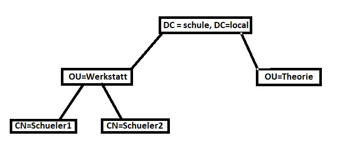

# Verzeichnisdienste mit LDAP

- [Foliensatz](./Verzeichnisdienste_ELSI.pdf)
- [Ausarbeitung: X.500](./Verzeichnisdienste_X500.pdf)
- [Ausarbeitung: Replikation](./Verzeichnisdienste_Replikation.pdf)
- [Ausarbeitung: Active Directory Domain Services](./Verzeichnisdienste_ADDS.pdf)

## Fragestellung: Einrichten eines Verzeichnisdienstes

Ausgangssitation: Gemischte Umgebung mit Windows und Linux, in diesem Netzwerk soll ein Verzeichnisdienst eingerichtet werden. Die Wahl fällt auf Active Directory.

* Nennen Sie auch andere Arten von Verzeichnisdiensten und vergleichen Sie diese (Vorteile, Nachteile)
    * eDirectory, Lightweight Directory Access Protocol, Domain Name Service, Network Information Service
    * Vorteile:
        * Zentrale Verwaltung für Benutzerdaten
        * Vereinfachte Berechitungsvergabe per Gruppenfunktion

* Nennen Sie den Vater aller Verzeichnisdienste
    * X.500
    * Ist ein Standard, der Aufbau eines Verzeichnisdienstes beschreibt
    * Von ihm gibt es keine vollständige Implementierung

* Erklären Sie Schema, Objekt, Attribut, ....
    * Schema: Bauplan eines Objekts
    * Objekt: Instanz eines Schemas
    * Attribut: Eigenschaften eines Objektes (Name, Telefonnummer, E-Mail, …)

* Erstellen Sie ein kleines Namensraumsmodell (siehe SMÜP) (der Baum)

* Erstellen Sie eine LDIF Datei, die diesen Baum importiert

* Erklären Sie was eine LDIF Datei ist, Verwendung, ...
    * LDIF ... LDAP Data Interchange Format 
    * ASCII Textdatei zum Im- und Exportieren von Verzeichnisstrukturen

* Über welches Protokoll greift man von Linux auf das AD zu
    * LDAP